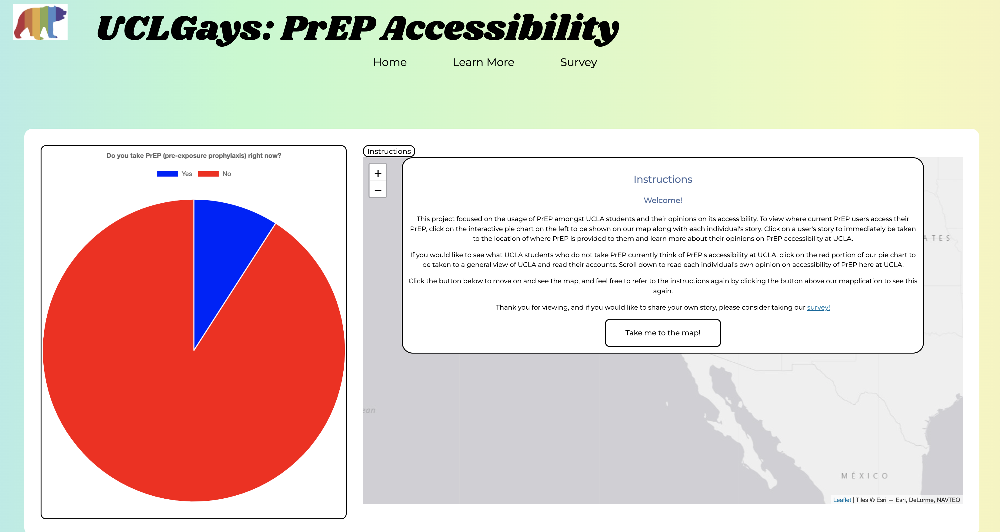
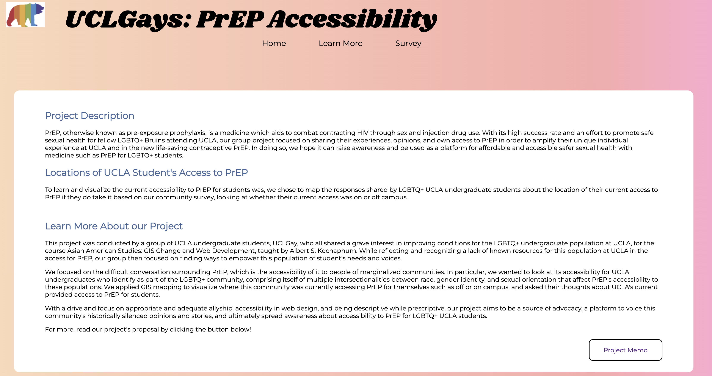

# Asia Am 191A Spring Project: Elucidating UCLA Undergraduate LGBTQ+ Community Perspectives on PrEP Accessibility

## Objective
The purpose of this project is to highlight the voices of UCLA students who identify as LGBTQ+ and are or are interested in being sexually active, specifically regarding the accessibility of PrEP in the areas in which they live. The mapplication will display different narratives of struggles in obtaining PrEP while also showcasing where students who currently utilize PrEP obtain their medication.

## WWho is being empowered by your mapplication?
Since the 1980’s HIV/AIDS epidemic, the LGBTQ+ community within the United States has grown increasingly cognizant of the impact that HIV has had on the queer community. Medical advancements in recent years have led to the creation of Pre-Exposure Prophylaxis, an HIV-preventative medication commonly referred to as PrEP. Given PrEP’s extreme importance to the queer community, it is extremely concerning that recent studies show how the uptake of PrEP in high risk neighborhoods, particularly college campuses, remains low, as some studies suggest that while knowledge of HIV amongst college students is high, knowledge of PrEP and utilization of protection like condoms is much lower. The risk at college campuses, in addition to our own positionality as UCLA students, brings us to focus on the UCLA campus. Although no UCLA-specific studies on PrEP exist, because the UCLA has a large undergraduate college student population as a public university and also serves a substantial percentage of students of color, the university’s undergraduate queer students are more likely to face issues in PrEP knowledge, usage, and accessibility. This gap in information therefore makes our project extremely important to the undergraduate UCLA queer community.

## What technology was used?
We used HTML, CSS, and JavaScript for the development of the web app. We created the interactive map showing where students obtain PrEP using Leaflet, and we created the bar chart comparing the number of PrEP users vs non-PrEP users using Chart.js. Papaparse allows us to parse through the CSV formatted data we obtained using Google Forms and Google Sheets.

## Features
List the ready features here:
- Visual Chart: Displays how many survey respondents take/do not take PrEP right now. This chart is interactive and then affects the map
- Mapplication: The map features the diifferentt stories related to satisfaction of PrEP accessibility at UCLA in addition to struggles with obtaining PrEP. The mapplication also displays where students who currently take PrEP obtain their medication from
- Buttons Galore: We havee buttons on our main page for viewers to go take the survey or view our group memo.

## What is potential long term impact of this project?
The potential long-term impact of this project is becoming a source that will share the accounts of queer UCLA students as a means to advocate for easily accessible sexual health resources like PrEP and promote practicing safe sexual health amongst the queer population at UCLA. For instance, this project can vocalize and visualize the stories of queer UCLA students to advocate for accessible PrEP on campus, as right now, UCLA offers little to no guidance in accessing PrEP. With the connection of several UCLA organizations and clubs that share the same mission of allyship, petitions can be made and shared to advocate for accessible PrEP to Bruins available on campus on sites such as the LGBT Center and Ashe Center.  The limitations on this would entail having to understand how such centers can regulate the distribution of PrEP, but this project would at least begin the first step of having that conversation with important stakeholders in the first place. In addition to advocating for this implementation of accessible and affordable PrEP for UCLA students, this project can also be used to spread awareness to the UCLA population about the benefits of using PrEP and resources available for Bruins who want to practice safer sexual health. Spreading awareness about preventatives such as PrEP can be amongst peers, in addition to organization-led informative workshops, fliers, and infographics hosted and shared by LGBTQ+ organizations online and on campus that can reach more queer Bruins. The accounts of our project can bring new conversations to these organizations that are interested in creating a safer and welcoming space at UCLA for queer students, safer sex and health practices, and accessibilty.

## Screenshots

## Limitations/Room for Improvement

At this time, we acknowledge two main limitations of our project:

- The number of responses we have are extremely limited, particularly in regards to the number of survey respondents who currently take PrEP. Although we reached out to numerous LGBTQ+ serving campus organizations like the Student Wellness Commission and the Lavender Health Alliance, we unfortunately did not receive as many responses as we hoped for.  In terms of our map functionality, therefore, when you click on the “yes” section of the pie chart, it only leads to one location and one story because of the lack of “yes” responses. Although this may speak to the lack of queer undergraduate UCLA students taking PrEP, we cannot draw that conclusion from our mapplication partially because of the limited number of responses. This leads to our second limitation.
- Our project is descriptive, not prescriptive. The goal of our project is not to compile resources for the community nor is it in and of itself going to change PrEP accessibility at UCLA. However, what this project has taught us is the power of creating space for stories that were not there before. Our technology does not need to immediately solve every single problem right now, especially when community voices are not heard related to PrEP. As such, our project acts as a facilitator for the community to share their stories and then in the future take this information as a conduit of action in whatever way they see fit. 

To do:
- Obtain more survey respondents
- Improve CSS styling for the website further
- Further design our own logo
- Partner with student organizations on campus to expand outreach and receive more feedback on website